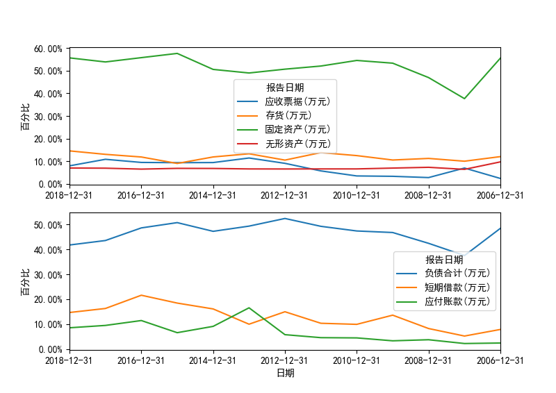
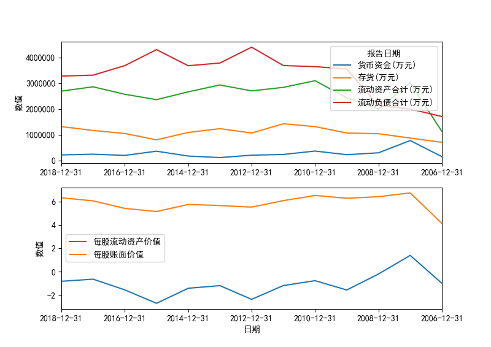
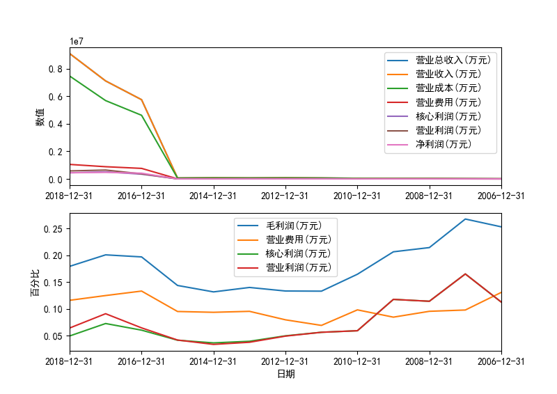
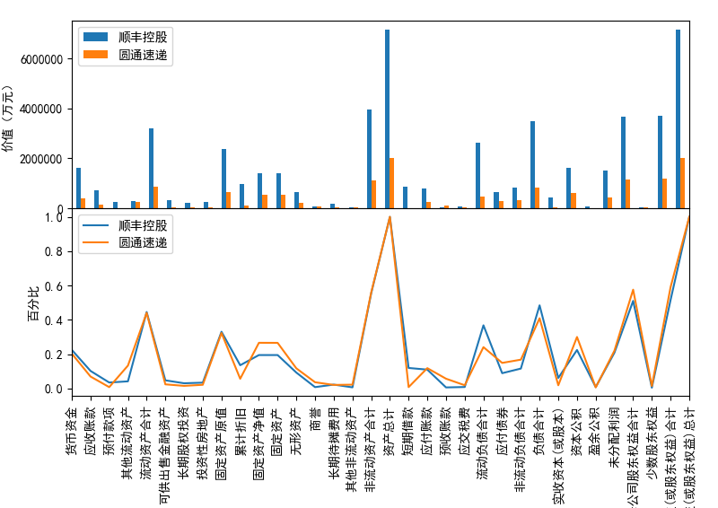

`stock-toolbox` is not one specified software，and no specified design purpose for
this project, it is a learning practice for stock analyzing.

This project is pure `python` and support the following basic functionalities:

- Trade Analysis
  - Pick up minimum price/maximum print from given trade records (by month)
  - Store the result to .csv file
  - Plotting

- Financial Statement Analysis
  - For single stock
    - common-size analysis, assert estimation from balance sheet and store result
      in .csv file
    - profit estimation from income statement and store result in .csv file
    - Plotting    
  - For multiply stocks

Some reminders:

- The script is developed under `Windows` and only `A stocks` as objects.
- Remember change to `...\stock-toolbox\src` which is used for working directory.
- Raw data is needed before running analysis script:
  - for trade analysis, copy raw data file into `.\data\trade`
  - for report analysis, copy raw data file into `.\data\report`

# 1 Trade Analysis

Only support the trade analysis for one stock.

- Get the minimum and maximum price by month

```
python start.py -s 002352 --option trade
```

- Specify time range

```
python start.py -s 002352 -o trade --startdate 201501 --enddate 201808
```

# 2 Report Analysis

## 2.1 Single Stock

### Balance Sheet

There are two diagrams for balance sheet analysis:

- common size analysis for assets and liabilities
- the current asset presentation

```
python start.py -o balance -s 000898
```





### Income Statement

The common-size analysis has been dropped, and two aspects trends are given:

- trends for operation revenue and several kinds of profits
- trends for ratio of major profits and operation expense

Execute following command in working directory to produce trend chart:

```
python start.py -s 002352 -o income
```




### Cash flow Statement

1. Show net cash flow from "operating activities", "investing activities" and "
financing activities", and compare "net cash flow from operating activities" with
 "net profit"


2. Compare cash flow items with balance statement items

- "cash received from the sale of goods and services" and "operating income"
- "year-end cash and cash equivalent balance" and "interest-bearing liabilities"


Execute following command in working directory to produce trend chart:

```
python start.py -s 002352 -o income
```

## 2.2 Multiply Stock

在对多只股票进行对比分析的时候，默认以最近一个会计年度的报表数据进行对比。目前支持针对多
只股票的资产负债表项目和利润表项目进行对比，绘制图形从绝对值和百分比两个角度进行展现。

### 资产负债表对比

```
python start.py -s 002352 600233 -o balance
```



### 利润表对比

```
python start.py -s 002352 600233 -o income
```


